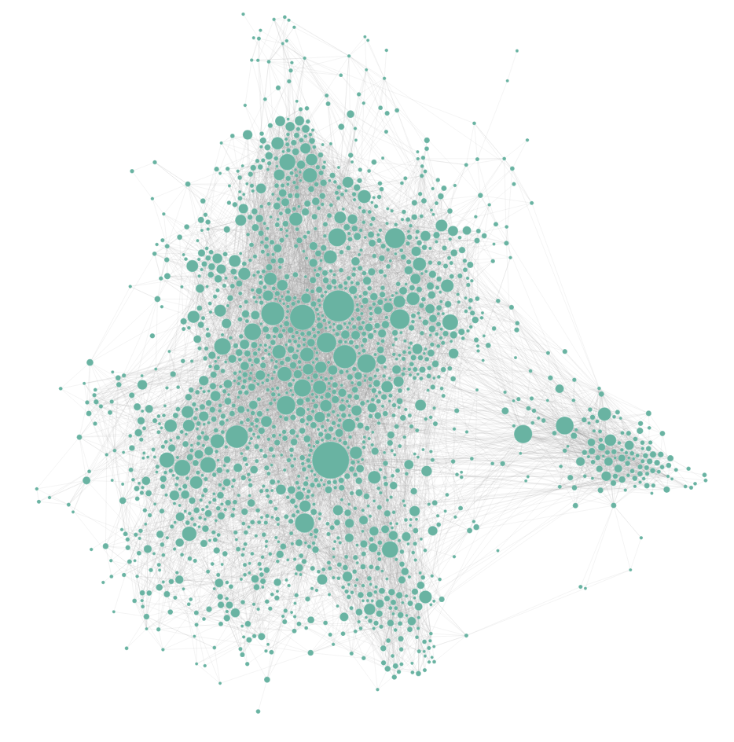

### How to run research
- Run LMStudio
- Put articles of interest in the “to research” folder.
- Run `python3 rag.py`

### How to get results
- Run `python3 -m http.server 8000`
- Open `localhost:8000` in browser

### TODO
- Add the resulting articles to the RAG system and the ability to ask questions of the data.

### DEMO
- See index.html + document_links.json

